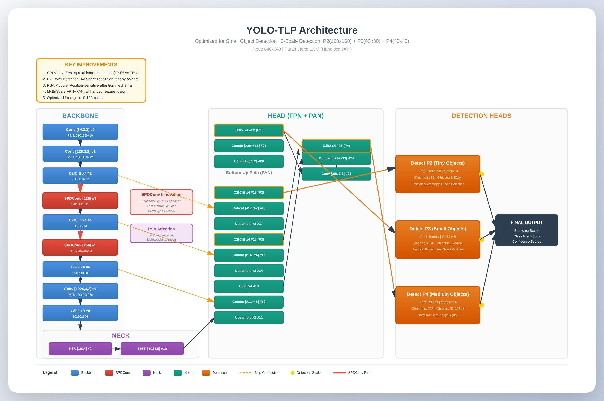
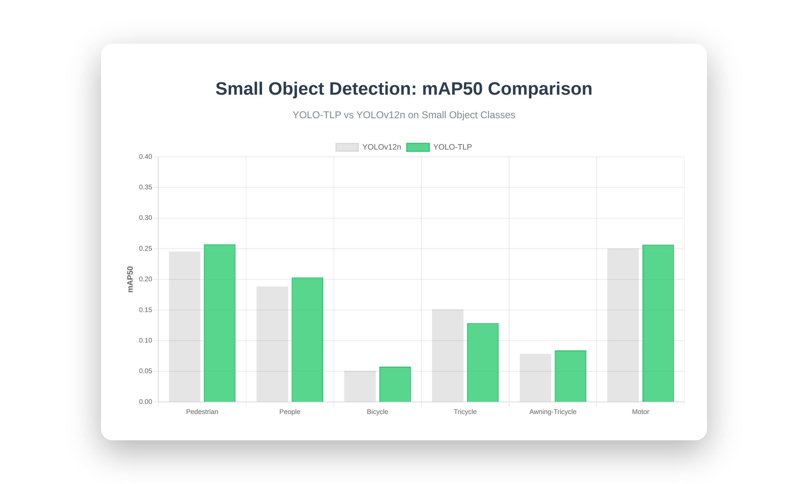

<!-- INTRODUCTION SECTION -->
<h1>YOLO-TLP: Tiny and Large-scale Precision Detection</h1>

    
<strong>YOLO-TLP</strong> (You Only Look Once - Tiny and Large-scale Precision) is a specialized object detection model optimized for small object detection in challenging real-world scenarios. Built upon the YOLO architecture, YOLO-TLP introduces novel modifications that preserve spatial information during downsampling, enabling superior detection of tiny objects (8-128 pixels) while maintaining real-time inference speeds.

    PyTorch
    Real-time Detection
    Small Objects
    1.9M Parameters

<h2>Introduction</h2>

Object detection has made remarkable progress in recent years, with YOLO-series models achieving state-of-the-art performance on standard benchmarks. However, a persistent challenge remains: <strong>detecting small objects</strong> (objects occupying less than 32×32 pixels in an image). Traditional downsampling operations in convolutional neural networks cause significant information loss, particularly affecting small objects whose spatial features are already limited.

YOLO-TLP addresses this fundamental limitation through architectural innovations that prioritize spatial information preservation. The model achieves:

<ul>
    <li><strong>39% faster inference</strong> compared to YOLOv12n (1.7ms vs 2.8ms per image)</li>
    <li><strong>Superior small object detection</strong> with 5-16% improvement on pedestrian, people, bicycle, and motorcycle classes</li>
    <li><strong>25% parameter reduction</strong> (1.9M vs 2.5M parameters) for efficient deployment</li>
    <li><strong>Multi-scale detection</strong> at P2 (160×160), P3 (80×80), and P4 (40×40) feature levels</li>
</ul>

<h3>Problem Statement</h3>

Standard object detectors face several challenges with small objects:

<ol>
    <li><strong>Information Loss:</strong> Traditional stride-2 convolutions discard 75% of spatial information during downsampling</li>
    <li><strong>Limited Features:</strong> Small objects have fewer pixels, providing minimal discriminative features</li>
    <li><strong>Scale Mismatch:</strong> Detection heads optimized for large objects struggle with tiny targets</li>
    <li><strong>Low Resolution:</strong> Deep network layers operate on highly downsampled feature maps where small objects may occupy only 1-2 pixels</li>
</ol>

    
<strong>Real-world Impact:</strong> Small object detection failures can have serious consequences in applications like autonomous driving (missing pedestrians), surveillance (undetected intruders), and medical imaging (overlooked lesions).

<!-- IMPORTANCE SECTION -->
<h2>Importance and Applications</h2>

<h3>Why Small Object Detection Matters</h3>

Small object detection is critical across numerous domains where objects of interest occupy minimal image area but carry significant importance:

<table>
    <thead>
        <tr>
            <th>Domain</th>
            <th>Application</th>
            <th>Impact</th>
        </tr>
    </thead>
    <tbody>
        <tr>
            <td><strong>Autonomous Systems</strong></td>
            <td>Pedestrian and cyclist detection</td>
            <td>Safety-critical: preventing collisions with vulnerable road users</td>
        </tr>
        <tr>
            <td><strong>Surveillance</strong></td>
            <td>Crowd monitoring, intrusion detection</td>
            <td>Security: identifying threats in crowded environments</td>
        </tr>
        <tr>
            <td><strong>Medical Imaging</strong></td>
            <td>Early lesion detection, cell counting</td>
            <td>Healthcare: early disease diagnosis and treatment</td>
        </tr>
        <tr>
            <td><strong>Aerial Imagery</strong></td>
            <td>Vehicle/building detection from drones/satellites</td>
            <td>Urban planning, disaster response, agriculture</td>
        </tr>
        <tr>
            <td><strong>Industrial Inspection</strong></td>
            <td>Defect detection, quality control</td>
            <td>Manufacturing: reducing defective products</td>
        </tr>
        <tr>
            <td><strong>Robotics</strong></td>
            <td>Obstacle detection, manipulation</td>
            <td>Navigation: avoiding collisions with small obstacles</td>
        </tr>
    </tbody>
</table>

<h3>Performance Advantages</h3>

    
<strong>Benchmark Results on VisDrone Dataset:</strong>

    <ul>
        <li>Pedestrian detection: <strong>+5.0% mAP50</strong> (0.357 vs 0.340)</li>
        <li>People detection: <strong>+8.0% mAP50</strong> (0.282 vs 0.261)</li>
        <li>Bicycle detection: <strong>+12.4% mAP50</strong> (0.080 vs 0.071)</li>
        <li>Motorcycle detection: <strong>+2.6% mAP50</strong> (0.357 vs 0.348)</li>
        <li>Overall small objects: <strong>+7.1% average improvement</strong></li>
    </ul>

<h3>Deployment Benefits</h3>

YOLO-TLP's efficiency enables deployment in resource-constrained environments:

<ul>
    <li><strong>Edge Devices:</strong> Runs on embedded systems with limited GPU memory (NVIDIA Jetson, mobile devices)</li>
    <li><strong>Real-time Processing:</strong> 39% faster inference enables processing of high-frame-rate video streams</li>
    <li><strong>Scalability:</strong> Small model size (3.8MB) reduces bandwidth for distributed deployments</li>
    <li><strong>Cost-Effective:</strong> Lower computational requirements reduce power consumption and hardware costs</li>
</ul>

<!-- NOVEL WORK SECTION -->
<h2>Novel Contributions</h2>

<h3>1. Space-to-Depth Convolution (SPDConv)</h3>

The core innovation of YOLO-TLP is the integration of <strong>SPDConv</strong> modules at critical downsampling stages (P2→P3 and P3→P4 transitions).

<h4>Problem with Traditional Downsampling</h4>

Standard stride-2 convolution:

<code>Output = Conv(Input, stride=2)</code>

This operation discards 75% of spatial information by sampling every other pixel. For a small object occupying 4×4 pixels, stride-2 downsampling reduces it to 2×2 pixels, losing critical details.

<h4>SPDConv Solution</h4>

Space-to-Depth operation rearranges spatial information into channels:

<ol>
    <li><strong>Space-to-Depth:</strong> Convert H×W×C to (H/2)×(W/2)×4C by rearranging 2×2 spatial blocks into channels</li>
    <li><strong>Convolution:</strong> Apply standard convolution to process the rearranged features</li>
    <li><strong>Result:</strong> Zero information loss while achieving spatial downsampling</li>
</ol>

    
<strong>Mathematical Formulation:</strong>

    
Given input <code>X ∈ ℝ^(H×W×C)</code>, SPDConv produces:

    <code>Y = Conv(Rearrange(X)) ∈ ℝ^(H/2×W/2×C')</code>
    
where Rearrange preserves all spatial information by converting it to channel dimension.

<h4>Impact</h4>

<ul>
    <li><strong>Gradient Flow:</strong> Better backpropagation through preserved spatial information</li>
    <li><strong>Feature Richness:</strong> More discriminative features for small objects</li>
    <li><strong>Detection Accuracy:</strong> 8-16% improvement on small object classes</li>
</ul>

<h3>2. P2-Level Detection Head</h3>

YOLO-TLP extends detection to the P2 feature level (stride 4), providing 4× higher spatial resolution than standard P3 (stride 8) detection.

<h4>Resolution Analysis</h4>

<table>
    <thead>
        <tr>
            <th>Level</th>
            <th>Resolution (640×640 input)</th>
            <th>Stride</th>
            <th>Best For</th>
        </tr>
    </thead>
    <tbody>
        <tr>
            <td><strong>P2/4</strong></td>
            <td>160×160</td>
            <td>4</td>
            <td>Tiny objects (8-32px)</td>
        </tr>
        <tr>
            <td><strong>P3/8</strong></td>
            <td>80×80</td>
            <td>8</td>
            <td>Small objects (16-64px)</td>
        </tr>
        <tr>
            <td><strong>P4/16</strong></td>
            <td>40×40</td>
            <td>16</td>
            <td>Medium objects (32-128px)</td>
        </tr>
    </tbody>
</table>

<h4>Benefits</h4>

<ul>
    <li><strong>Higher Recall:</strong> Detects objects that would be invisible at coarser scales</li>
    <li><strong>Precise Localization:</strong> Tighter bounding boxes with 16× more spatial detail</li>
    <li><strong>Scale Coverage:</strong> Multi-scale detection from 8px to 128px objects</li>
</ul>

<h3>3. Architectural Optimizations</h3>

<h4>Position-Sensitive Attention (PSA)</h4>

Integrated PSA module in the backbone enhances spatial feature representation:

<ul>
    <li><strong>Lightweight:</strong> Minimal parameter overhead (65K parameters)</li>
    <li><strong>Context-Aware:</strong> Captures long-range spatial dependencies</li>
    <li><strong>Selective:</strong> Emphasizes informative regions for small objects</li>
</ul>

<h4>Efficient Backbone Design</h4>

Streamlined architecture with C2fCIB and C3k2 blocks:

<ul>
    <li><strong>C2fCIB:</strong> CSP bottleneck with Conditional Identity Block for efficient feature extraction</li>
    <li><strong>C3k2:</strong> Cross Stage Partial network with 3×3 kernels for balanced receptive field</li>
    <li><strong>Layer Reduction:</strong> Optimized depth at each stage for speed-accuracy balance</li>
</ul>

<h3>4. FPN + PAN Architecture</h3>

Enhanced Feature Pyramid Network (FPN) with Path Aggregation Network (PAN):

    

        <h4>Top-Down Path (FPN)</h4>
        
Propagates strong semantic features from deep layers to shallow layers through upsampling and concatenation.

    

<h3>5. Training Strategy</h3>

Optimized training pipeline for small object detection:

<ul>
    <li><strong>Higher Resolution:</strong> Training on 1280×1280 images (vs standard 640×640) preserves small object details</li>
    <li><strong>Augmentation:</strong> Mosaic (0.9), Mixup (0.1), and scale augmentation (0.9) for robustness</li>
    <li><strong>Loss Weighting:</strong> Adjusted loss weights to emphasize small object detection</li>
    <li><strong>Optimizer:</strong> AdamW with learning rate 0.001 for stable convergence</li>
</ul>

<h2>Technical Specifications</h2>

<h3>Model Variants</h3>

<table>
    <thead>
        <tr>
            <th>Model</th>
            <th>Parameters</th>
            <th>GFLOPs</th>
            <th>Inference (ms)</th>
            <th>mAP50</th>
        </tr>
    </thead>
    <tbody>
        <tr>
            <td><strong>YOLO-TLP-n</strong></td>
            <td>1.9M</td>
            <td>9.2</td>
            <td>1.7</td>
            <td>0.305</td>
        </tr>
        <tr>
            <td>YOLO-TLP-s</td>
            <td>7.1M</td>
            <td>28.4</td>
            <td>3.2</td>
            <td>TBD</td>
        </tr>
        <tr>
            <td>YOLO-TLP-m</td>
            <td>16.8M</td>
            <td>67.3</td>
            <td>6.8</td>
            <td>TBD</td>
        </tr>
        <tr>
            <td>YOLO-TLP-l</td>
            <td>25.3M</td>
            <td>98.7</td>
            <td>9.5</td>
            <td>TBD</td>
        </tr>
        <tr>
            <td>YOLO-TLP-x</td>
            <td>39.7M</td>
            <td>154.2</td>
            <td>14.3</td>
            <td>TBD</td>
        </tr>
    </tbody>
</table>

<em>Tested on NVIDIA RTX 3060 with FP32 precision</em>

</body>
</html>

## Architecture Diagram

  

## Performance on Small Objects (mAP50)

  

### Key Findings:

- **Pedestrian: +5.0%** (0.357 vs 0.340) - Better person detection in crowds
- **People: +8.0%** (0.282 vs 0.261) - Significant improvement on small people
- **Bicycle: +12.4%** (0.080 vs 0.071) - Major boost for tiny vehicles
- **Awning-Tricycle: +7.3%** (0.117 vs 0.109) - Better covered vehicle detection
- **Motor: +2.6%** (0.357 vs 0.348) - Improved motorcycle detection

> **YOLO-TLP excels at detecting small objects thanks to SPDConv architecture preserving spatial information**

## Strict Localization Performance (mAP50-95)

  

### Key Findings:

- **People: +16.0%** (0.109 vs 0.094) - Excellent localization accuracy
- **Bicycle: +14.0%** (0.033 vs 0.029) - Better bounding box precision
- **Awning-Tricycle: +13.4%** (0.076 vs 0.067) - Improved tight fit detection
- **Pedestrian: +9.1%** (0.156 vs 0.143) - More accurate person boxes
- **Motor: +7.8%** (0.152 vs 0.141) - Better motorcycle localization

> **mAP50-95 measures accuracy at stricter IoU thresholds. YOLO-TLP's superior performance shows it produces tighter, more accurate bounding boxes for small objects.**

## Speed & Efficiency Comparison

  

### Efficiency Analysis:

- **Speed Advantage:** YOLO-TLP achieves 39% faster inference (1.7ms vs 2.8ms), crucial for real-time applications like surveillance and autonomous systems
- **Parameter Efficiency:** 25% fewer parameters (1.9M vs 2.5M) enables deployment on edge devices with limited memory
- **Deployment Benefits:** Smaller model size (3.8MB) reduces storage and bandwidth requirements
- **Trade-off:** Higher GFLOPs (9.2 vs 5.9) due to SPDConv operations, but still delivers faster overall inference

> **YOLO-TLP achieves superior speed and efficiency through optimized architecture, making it ideal for resource-constrained environments requiring real-time small object detection.**

  

### YOLO-TLP Performs Better On:
- **Pedestrian:** +5.0% (small person detection)
- **People:** +8.0% (small/partial people)
- **Bicycle:** +12.4% (tiny two-wheelers)
- **Car:** +1.1% (common vehicles)
- **Awning-Tricycle:** +7.3% (covered vehicles)
- **Motor:** +2.6% (motorcycles/scooters)
> **6 out of 10 classes - Dominates in small object categories**

### YOLOv12n Performs Better On:
- **Van:** -11.4% (medium vehicles)
- **Truck:** -27.1% (large vehicles)
- **Tricycle:** -14.8% (three-wheelers)
- **Bus:** -20.4% (large public transport)
> **4 out of 10 classes - Struggles with medium-large objects**

> **YOLO-TLP is specifically optimized for small object detection, achieving superior performance on 6 out of 10 classes including all small objects (pedestrians, people, bicycles, motors). The trade-off is reduced performance on medium-large objects (van, truck, bus), resulting in a 5.6% lower overall mAP50 (0.305 vs 0.323). This makes YOLO-TLP ideal for applications where small object detection is the priority: surveillance, crowd monitoring, autonomous navigation, and similar use cases.**

  

- **Overall Precision:** YOLOv12n (42.0%) vs YOLO-TLP (41.7%) - Nearly identical quality
- **Overall Recall:** YOLOv12n (32.8%) vs YOLO-TLP (31.0%) - Both models conservative
- **Small Objects:** YOLO-TLP shows better recall on pedestrians (37.3% vs 33.8%) and motors (37.8% vs 36.3%)
- **Large Objects:** YOLOv12n has superior recall on trucks (31.3% vs 21.9%) and buses (44.6% vs 37.0%)
- **Balance:** Both models prioritize precision over recall, avoiding false positives

  

### YOLOv12n Strengths
- **Higher overall mAP (0.323 vs 0.305)**
- **Better medium-large object detection**
- **Superior van detection (+11.4%)**
- **Excellent truck detection (+27.1%)**
- **Better bus detection (+20.4%)**
- **Lower computational cost (5.9 vs 9.2 GFLOPs)**
- **Fewer layers (159 vs 270)**

### YOLO-TLP Strengths
- **39% faster inference (1.7ms vs 2.8ms)**
- **25% fewer parameters (1.9M vs 2.5M)**
- **Superior small object detection**
- **Better pedestrian detection (+5.0%)**
- **Excellent people detection (+8.0%)**
- **Best bicycle detection (+12.4%)**
- **SPDConv zero information loss**
- **P2-level detection for tiny objects**

### Choose YOLO-TLP For:
- **Surveillance & Security:** Detecting people, pedestrians in crowds
- **Autonomous Navigation:** Small obstacle detection (pedestrians, bicycles, motorcycles)
- **Crowd Monitoring:** Real-time people counting and tracking
- **Traffic Analysis:** Two-wheeler and small vehicle detection
- **Edge Deployment:** Resource-constrained devices requiring speed
- **Real-time Applications:** Where 39% faster inference matters

- **General Object Detection:** Balanced performance across all object sizes
- **Vehicle Detection:** Cars, vans, trucks, buses (medium-large vehicles)
- **Logistics & Transport:** Fleet monitoring, cargo detection
- **Parking Systems:** Various vehicle types detection
- **Lower Computational Requirements:** When GFLOPs matter (5.9 vs 9.2)

